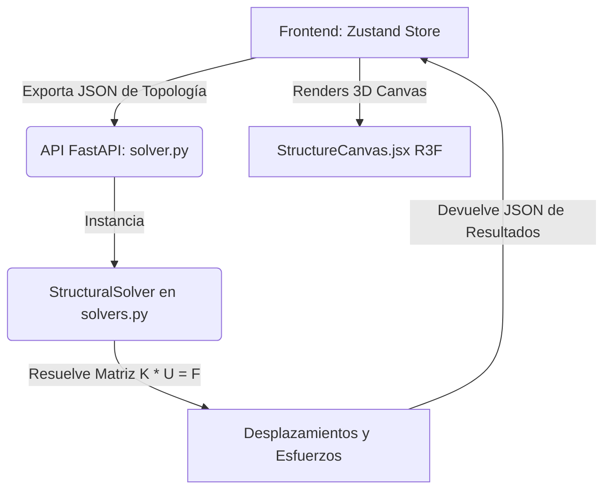

# ARKO3D — Guía de Arquitectura Técnica 🛠️

Este documento describe detalladamente la lógica interna, el flujo de datos, la formulación matemática y el sistema de renderizado del módulo **ARKO3D** en la plataforma Arko 360. 

Su propósito es servir como el **punto único de referencia** para entender el funcionamiento global y facilitar la adición de nuevas características sin necesidad de descifrar todo el código fuente desde cero.

---

## 1. Arquitectura de Alto Nivel y Flujo de Datos

ARKO3D opera bajo una arquitectura desacoplada Cliente-Servidor:

1. **Modelado y Estado (Frontend):** Zustand (`useStructureStore.js`) mantiene el estado de la estructura en memoria: nudos, barras, losas (shells), secciones, materiales y cargas.
2. **Serialización:** Cuando el usuario ejecuta el análisis, el frontend convierte la topología a un JSON estructurado según los esquemas de Pydantic (`backend/app/schemas/fea3d.py`).
3. **Cálculo (Backend):** El backend en Python recibe el modelo, corre el solucionador de matriz de rigidez global y retorna un JSON con los desplazamientos nodales y las fuerzas internas a lo largo de los elementos (en 21 estaciones de control).
4. **Visualización (Frontend):** React Three Fiber (`StructureCanvas.jsx`) recibe los desplazamientos y esfuerzos, deformando tridimensionalmente la retícula y pintando diagramas de corte/momento o mapas de calor (heatmaps).

---

## 2. Estructura de Datos (Esquema Común)

El modelo de datos se define formalmente en `backend/app/schemas/fea3d.py`. Los componentes esenciales son:

*   **Node (Nudo):** Coordenadas `(x, y, z)` y condiciones de apoyo `Restraint` (6 booleanos correspondientes a `[ux, uy, uz, rx, ry, rz]`).
*   **Element (Barra):** Línea recta que conecta un nudo inicial y uno final. Tiene asignada una sección, un material y un ángulo `beta_angle` (rotación sobre su propio eje longitudinal).
*   **Shell (Losa):** Polígono definido por 4 nudos de esquina (Quad). Contiene propiedades de espesor, material, cargas uniformes asignadas (CM/CV) y una malla interna (`Mesh`) opcional generada por el frontend.
*   **Mesh (Malla):** Contiene una sub-lista de `MeshNode` y `MeshElement` (cuadriláteros o triángulos más pequeños) que discretizan el área de la losa para el análisis por elementos finitos.

---

## 3. Motor de Cálculo (Backend Python)

El motor matemático reside en `backend/app/engine/`. Su archivo principal es `solvers.py`, el cual ejecuta los siguientes pasos secuenciales:

### 3.1. Fusión de Nodos de Malla
Para garantizar la continuidad estructural entre losas adyacentes y con las vigas perimetrales, el solver realiza una **fusión espacial de nudos** en `__init__`:
*   Si un `MeshNode` de la malla de losa se encuentra a una distancia menor a $10^{-4}$ m (0.1 mm) de un `Node` de pórtico principal o de otro `MeshNode`, se mapea al mismo ID global.
*   Esto une matemáticamente la losa con el esqueleto de vigas y columnas del edificio.

### 3.2. Subdivisión Automática de Pórticos
Cuando una viga tiene nodos de malla de losa sobre su longitud, se subdivide automáticamente en múltiples segmentos (`elements` temporales de menor longitud):
*   Esto asegura la **compatibilidad de desplazamientos** en puntos intermedios entre vigas y losas, evitando que la losa se "descuelgue" visualmente de la viga en el análisis.
*   Posterior al cálculo, el solver re-combina los resultados de los segmentos en las estaciones del elemento original para entregárselo limpio al frontend.

### 3.3. Ensamblaje de la Matriz de Rigidez Global ($K$)
La rigidez de la estructura es la suma de las contribuciones de barras y losas:
1.  **Barras (Frame):** Formulación de barra 3D de Euler-Bernoulli en `fem_frame.py` (flexión en dos planos, torsión de Saint-Venant y rigidez axial). Genera una matriz local de $12 \times 12$.
2.  **Losas (Shell):** Formulación Quad4 en `fem_shell.py` que combina:
    *   **Membrana (Plane Stress):** Comportamiento en su propio plano XY.
    *   **Flexión (Mindlin-Reissner):** Comportamiento perpendicular a su plano (Z). Utiliza **Integración Reducida Selectiva (1x1)** en corte para evitar el bloqueo por cortante (*shear locking*), estabilizada contra modos de energía cero (*hourglass mode*) mediante un 5% de integración completa ($2 \times 2$, $\alpha=0.05$).
    *   **Drilling (Rotación Rz):** Rigidez ficticia en el grado de libertad Rz para evitar singularidades matemáticas.
    *   La matriz local de cada elemento del shell es de $24 \times 24$.
3.  **Matriz Global:** Las matrices locales se rotan al espacio global usando `beta_angle` y la dirección del elemento, y se ensamblan en una matriz dispersa `scipy.sparse.csr_matrix` de tamaño $ndof \times ndof$, donde $ndof = \text{nudos} \times 6$.

### 3.4. Condiciones de Apoyo (Boundary Conditions)
Las restricciones de los nudos (apoyos fijos, articulados, etc.) se aplican mediante el **Método de Penalización (Penalty Method)**:
*   Para cada grado de libertad restringido (verdadero en `Restraint`), se suma un valor masivo ($10^{30}$) a la diagonal de la matriz $K$ en esa fila/columna. Esto obliga al desplazamiento en ese grado de libertad a converger a cero durante la resolución.

### 3.5. Ensamblaje del Vector de Cargas ($F$) y Caso Dual
El sistema calcula el vector de fuerzas global $F$ considerando dos posibles estados para las losas:

*   **Caso CON MALLA (Shell Flexible / SAP2000):**
    Si la losa tiene definida una malla (`shell.mesh.elements`), la carga uniformemente distribuida de la losa ($q_{factored}$) se calcula por elemento finito:
    $$\text{Carga por Nudo} = \frac{q_{factored} \times \text{Área del Elemento Finito}}{N_{\text{nudos}}}$$
    Esta carga se aplica directamente hacia abajo ($Z = -F_z$) sobre los grados de libertad de los nodos de la malla. La rigidez a flexión del shell se encargará de transferir la carga a los apoyos y vigas de manera natural.
*   **Caso SIN MALLA (Membrana Rígida / ETABS):**
    Si la losa no tiene malla, se asume un comportamiento puramente tributario: la carga total se calcula y se redistribuye como carga equivalente uniforme ($w_{eq}$) a lo largo de las vigas perimetrales del cuadrilátero, simulando una losa que no aporta rigidez a flexión pero transmite gravedad.
*   **Cargas de Área (Parches):**
    Las cargas en áreas rectangulares de la losa (`area_shell`) se discretizan mediante **Integración en Grilla** en una matriz de mini-cargas puntuales. Utilizando funciones de forma bilineales ($N_i$), cada minicarga se reparte proporcionalmente a los 4 nudos del elemento de malla subyacente.

### 3.6. Resolución de Desplazamientos y Recuperación de Fuerzas
1.  Se resuelve el sistema lineal disperso: $U = K^{-1} \cdot F$ mediante `scipy.sparse.linalg.spsolve`.
2.  Para cada barra, se recuperan los desplazamientos globales de sus nudos y se transforman a locales. A partir de la matriz local y el vector de fuerzas fijas por carga distribuida (`f_fixed_local`), se calculan las fuerzas internas (axial, cortes, momentos y torsión) en **21 estaciones** a lo largo de la barra.
3.  **Curvatura de Barras:** Para cada estación, además de las fuerzas, el solver evalúa las deflexiones locales exactas transversales $v_y(x)$, $v_z(x)$ usando las **funciones de forma de Hermite** y la deformación axial local $v_x(x)$ de manera lineal.

---

## 4. Visualización y Renderizado (Frontend React/Three.js)

Toda la representación gráfica ocurre en `StructureCanvas.jsx` mediante React Three Fiber (R3F).

### 4.1. Curvatura de Elementos Pórtico (`FrameElement`)
Para que las columnas y vigas se dibujen curvadas bajo cargas (simulando SAP2000) en lugar de trazos rectos rotados, el componente realiza una reconstrucción tridimensional por estaciones en modo de resultados:

1.  **Extracción de Ejes Locales:**
    Calcula los vectores unitarios de dirección del elemento basados en las coordenadas de sus nudos inicial y final no deformados:
    *   $\vec{dirX}$ es el eje longitudinal (normalizado).
    *   $\vec{dirY}$ y $\vec{dirZ}$ son los ejes locales transversales (perpendiculares).
    *   Aplica la rotación dada por el ángulo beta del elemento:
        $$\vec{dirY}_{final} = \cos\beta \cdot \vec{dirY}_{sub} + \sin\beta \cdot \vec{dirZ}_{sub}$$
        $$\vec{dirZ}_{final} = -\sin\beta \cdot \vec{dirY}_{sub} + \cos\beta \cdot \vec{dirZ}_{sub}$$
2.  **Transformación a Coordenadas Globales Deformadas:**
    Para cada una de las 21 estaciones en la barra, lee los desplazamientos locales calculados en el backend: $ux$ (axial), $uy$ (deflexión Y) y $uz$ (deflexión Z). La coordenada tridimensional de renderizado en el mundo global es:
    $$\vec{P}_{global} = \vec{P}_{start} + \vec{dirX}_{final} \cdot (x + ux \cdot S_d) + \vec{dirY}_{final} \cdot (uy \cdot S_d) + \vec{dirZ}_{final} \cdot (uz \cdot S_d)$$
    Donde $S_d$ es la escala de deformación (`displacementScale`) regulada por el usuario.
3.  **Buffer Geometry:** Los puntos calculados se inyectan en un `THREE.BufferGeometry` para dibujar la línea curva continua.

### 4.2. Renderizado de Losas y Generación de Huecos
*   **Aberturas (Slab Openings):** Si la losa es plana en Z, se utiliza `THREE.Shape` y `THREE.ShapeGeometry`. Los huecos definidos se restan como trayectorias negativas (`shape.holes.push(holePath)`).
*   **Prevención de Errores de Triangulación:** Para evitar que Three.js falle al triangular cuando un hueco toca el borde de la losa, los vértices del hueco se **contraen microscópicamente (factor 0.9999)** hacia su propio centroide antes de la resta.

### 4.3. Heatmaps de Esfuerzos en Mallas de Losas (`ShellMeshVisualizer`)
Cuando la losa tiene malla y existen resultados del análisis:
1.  Se lee el esfuerzo seleccionado (ej: $M_{11}$, $M_{22}$ o $V_{max}$).
2.  Se asocian las coordenadas deformadas de los nudos usando un mapeo espacial por proximidad de IDs para evitar descalces.
3.  Cada cuadrilátero del mesh se colorea dinámicamente interpolando un gradiente de color (de Azul para esfuerzo mínimo a Rojo para esfuerzo máximo), entregando una visualización de mapa de calor de calidad profesional.

---

## 5. Guía para Agregar Nuevas Funcionalidades

Si deseas expandir el sistema, sigue estas instrucciones directas:

### ¿Cómo añadir una nueva verificación de diseño (barras o losas)?
1.  **Backend (Esquemas):** Si requiere nuevos parámetros de entrada (ej: límite de deflexión $L/360$), agrégalos en `Section` o `Element` en `backend/app/schemas/fea3d.py`.
2.  **Backend (Cálculo):** En `backend/app/engine/design_engine.py`, escribe la función que tome los desplazamientos nodales o fuerzas de barra recuperadas y aplique las fórmulas normativas correspondientes. Retorna los ratios de diseño en el diccionario `design_checks` en `StructuralSolver.solve()`.
3.  **Frontend (UI):** Modificar `landing/src/components/tools/fea3d/ResultsTableModal.jsx` para añadir una pestaña o columna con los ratios calculados.

### ¿Cómo añadir un nuevo tipo de carga?
1.  **Backend (Esquemas):** Añade el tipo en el Enum `LoadType` de `backend/app/schemas/fea3d.py` y define sus campos específicos en `LoadAssignment`.
2.  **Backend (Carga Global):** Modifica `assemble_load_vector` en `solvers.py` para interceptar este nuevo tipo de carga y escribir la lógica matemática para sumarla en el vector de fuerzas global $F$.
3.  **Frontend (UI):** Agrega el formulario correspondiente en `PropertyPanel.jsx` para capturar los inputs del usuario, y define su representación tridimensional en `StructureCanvas.jsx` (ej. una flecha orientada en la dirección de la carga).
