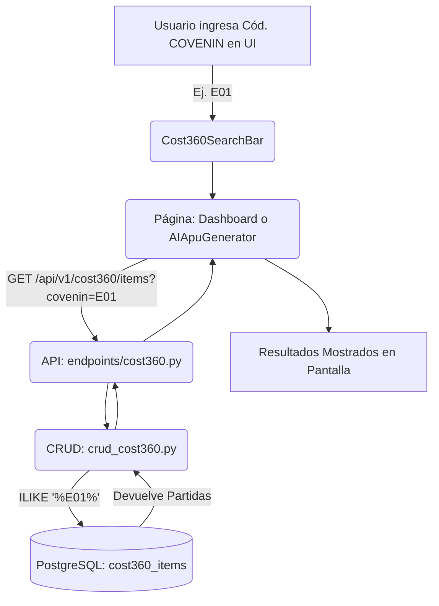

# Refactorización del Buscador y Corrección de Filtro COVENIN

**Fecha:** Agosto 2026

## 1. Problema Original
Se detectaron dos problemas relacionados con la búsqueda de partidas en el módulo Cost360:
1. **Filtro COVENIN inoperativo:** Al ingresar un código COVENIN en la interfaz (ej. "E01"), la aplicación no filtraba correctamente los resultados en la base de datos, comportándose como si el parámetro estuviera ausente.
2. **Código Duplicado (Violación DRY):** La estructura del formulario de búsqueda (inputs, selects, toggles de búsqueda inversa) estaba duplicada tanto en la pantalla principal del Visor (`Cost360Dashboard.jsx`) como en el generador/clonador de APUs con IA (`AIApuGeneratorPage.jsx`). Esto causaba que un arreglo en una pantalla no se reflejara en la otra (por ejemplo, el estado `searchCovenin` no estaba inicializado en una de ellas, lo que lanzaba un error `ReferenceError`).

## 2. Solución Aplicada

### 2.1 Refactorización Frontend (Componente Compartido)
Se extrajo toda la lógica y estructura visual del buscador hacia un nuevo componente reutilizable:
- **`admin/src/modules/cost360/components/Cost360SearchBar.jsx`**: Recibe por *props* los estados de búsqueda (`searchQuery`, `searchCovenin`, `searchChapter`, `searchDesc`, `searchInsumos`) y sus respectivos *setters*, además de una función `onSearch`.
- Se reemplazó el HTML complejo en `Cost360Dashboard.jsx` y `AIApuGeneratorPage.jsx` por una simple invocación de `<Cost360SearchBar />`.

Esta implementación centralizada asegura que futuras modificaciones (ej. añadir un nuevo filtro o cambiar el diseño) solo requieran editar un solo archivo, impactando todas las pantallas donde se busque información de costos.

### 2.2 Corrección de Filtro COVENIN en Backend
Al revisar el código backend (FastAPI), se detectó que el endpoint no estaba recibiendo el parámetro `covenin`, a pesar de que el frontend lo enviaba por URL.
Se actualizó el signature de los siguientes archivos:
- **`backend/app/api/v1/endpoints/cost360.py`**: Añadido el argumento opcional `covenin: Optional[str] = None` en la función `get_items()`.
- **`backend/app/crud/crud_cost360.py`**: Añadido el parámetro `covenin` a la función `get_items_paginated()` y modificada la consulta a la base de datos de PostgreSQL con un filtro `ILIKE` para buscar coincidencias parciales en el campo `CovPar` (`CostItem.CovPar.ilike(f"%{covenin}%")`).

## 3. Flujo de Búsqueda de Costos Actualizado

## 4. Despliegue Express
Para bypassar los problemas de límites de minutos en GitHub Actions, se crearon y utilizaron scripts de inyección directa hacia el servidor de producción (VPS):
- **`deploy_backend_fast.py`**: Lee los archivos locales de python, usa `scp` hacia `/tmp/` del VPS, e inyecta (usando `cat > ...` mediante `docker exec`) directamente a los archivos del contenedor `arko360_platform-backend-1` en cuestión de segundos, sin necesidad de reconstruir la imagen Docker desde cero.
- **`deploy_frontend.py`**: Ejecuta `vite build` localmente, crea un `.tar.gz`, lo sube al VPS y lo extrae directamente dentro del volumen del contenedor de Nginx (`arko360_platform-admin-frontend-1`).
